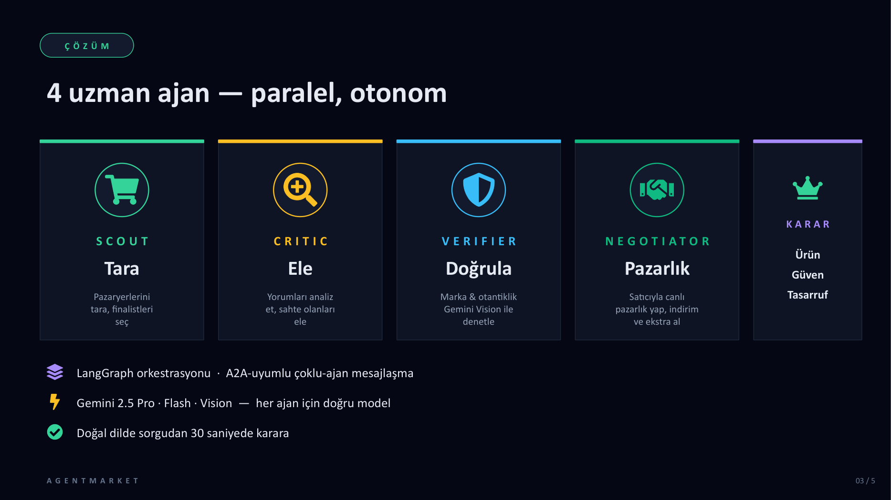

# AgentMarket

> **AI ajansınız Türk pazaryerlerinde sizin için arar, sahte yorumları eler, otantikliği doğrular ve satıcıyla pazarlık eder.**

BTK Hackathon 2026. **Çoklu-ajan alışveriş asistanı** — 5 uzman AI ajanı (Scout · Critic · Verifier · Negotiator · Decider) bir LangGraph-şekilli orkestrasyonda paralel çalışıyor. Kullanıcı doğal dilde sorduğu anda 4 sahneli bir UX akıyor: sorgu → ajan tiyatrosu (canlı stream) → pazarlık chat'i → karar kartı.



---

## Hızlı Başlangıç (Mock Mode — API key gerekmez)

```bash
# 1. Backend — terminal 1
cd backend
pip install pydantic python-dotenv "fastapi[standard]" "uvicorn[standard]"
MOCK_MODE=true python -m uvicorn app.api.main:app --port 8765

# 2. Frontend — terminal 2
cd frontend
npm install
npm run dev
# açar: http://localhost:3000
```

Sorgu yaz → 4 ajan canlı paralel akıyor → pazarlık chat'i açılıyor → karar kartı.

## Live Mode (Gerçek Gemini)

1. [Google AI Studio](https://aistudio.google.com/apikey) → Create API Key (free)
2. `backend/.env` dosyasını oluştur:
   ```
   GEMINI_API_KEY=AIzaSy...
   MOCK_MODE=false
   GEMINI_MODEL_FAST=gemini-2.5-flash-lite
   GEMINI_MODEL_PRO=gemini-flash-latest
   ```
3. `pip install google-genai`
4. Backend'i `MOCK_MODE=true` olmadan başlat.

Quota notu: free tier ~20 istek/gün/model. Bir pipeline ~25-30 çağrı yapar.
Çözüm: [`backend/.llm_cache/`](backend/.llm_cache/) disk cache — aynı prompt cache'den okunur.

---

## Repo Haritası

```
BTK Hackaton 2026/
├── README.md                     ← bu dosya
├── AgentMarket-Pitch.pptx        ← Jüri sunum (6 slayt)
├── AgentMarket-Pitch.pdf
├── build_pitch.js                ← Pitch deck'i regenerate eder
│
├── 01-PLAN.md                    ← Faz bazlı uygulama planı
├── 02-ARCHITECTURE.md            ← LangGraph topolojisi, state şeması
├── 03-AGENTS.md                  ← 5 ajan + prompt spec'leri
├── 04-TECH-STACK.md              ← Teknoloji seçimleri ve gerekçe
├── 05-UI-UX.md                   ← 3 sahne tasarımı
├── 06-DEMO-SCRIPT.md             ← 3 dk jüri demo akışı
├── 07-JURY-PITCH.md              ← Pitch içerikleri (slayt kaynağı)
├── 08-TIMELINE.md                ← T-14 → T-0 günlük plan
├── 09-RISKS.md                   ← 12 risk + Plan B/C/D
├── 10-DATA-SOURCES.md            ← Scraping, sandbox stratejisi
│
├── backend/                      ← FastAPI + LangGraph + Gemini
│   ├── README.md                 ← Backend detayı
│   ├── app/
│   │   ├── api/main.py           ← FastAPI + WebSocket endpoint
│   │   ├── agents/               ← Scout, Critic, Verifier, Negotiator, Decider, Orchestrator, Seller
│   │   ├── prompts/              ← Türkçe sistem prompt'ları
│   │   ├── models.py             ← Pydantic şemaları
│   │   ├── llm.py                ← Gemini wrapper + disk cache + mock
│   │   └── config.py
│   ├── seed/products.py          ← 15 deterministic test ürünü
│   ├── scripts/
│   │   ├── test_pipeline.py      ← Full pipeline CLI runner
│   │   ├── test_negotiation.py   ← Sadece pazarlık testi
│   │   ├── test_ws.py            ← WebSocket smoke-test
│   │   └── build_cache.py        ← Quota gelince 4 senaryoyu cache'le
│   └── .env.example
│
└── frontend/                     ← Next.js 15 + Tailwind + Framer Motion
    ├── app/
    │   ├── page.tsx              ← Sahne orchestrator (idle / running / done)
    │   ├── layout.tsx
    │   ├── globals.css           ← Dark theme, radial backdrop
    │   ├── lib/
    │   │   ├── types.ts          ← Backend payload TS karşılığı
    │   │   └── useAgentStream.ts ← WebSocket hook + reducer
    │   └── components/
    │       ├── QueryInput.tsx        ← Sahne 1
    │       ├── AgentTheater.tsx      ← Sahne 2 (5 ajan kartı)
    │       ├── FinalistsPanel.tsx    ← Aday ürünler canlı analiz
    │       ├── NegotiationChat.tsx   ← Pazarlık penceresi
    │       └── FinalCard.tsx         ← Sahne 3 (karar reveal)
    └── package.json
```

---

## Mimari Tek Bakışta

```
┌───────────────────────────────────────────────────────────────┐
│  FRONTEND (Next.js 15)                                        │
│  Sorgu → 5 ajan tiyatrosu → finalist grid → chat → karar      │
└────────────────────────┬──────────────────────────────────────┘
                         │ WebSocket (event stream)
┌────────────────────────▼──────────────────────────────────────┐
│  BACKEND (FastAPI + LangGraph-shaped orchestrator)            │
│                                                                │
│   Scout ──▶ Critic ─┐                                          │
│      │              ├─▶ Decider                                │
│      └──▶ Verifier ─┘     │                                    │
│                           ▼                                    │
│                       Negotiator ◀─▶ Sandbox Seller            │
│                                          (Gemini roleplay)     │
└────────────────────────────────────────────────────────────────┘
       │              │              │
       ▼              ▼              ▼
   ┌────────┐  ┌──────────┐  ┌──────────────┐
   │ Seed   │  │ Gemini   │  │ Disk cache   │
   │ products│ │ 2.5      │  │ (.llm_cache/)│
   │ (15)   │  │ Flash·Pro│  │              │
   └────────┘  └──────────┘  └──────────────┘
```

Detay: [02-ARCHITECTURE.md](02-ARCHITECTURE.md), [03-AGENTS.md](03-AGENTS.md).

---

## Ajan Rolleri

| Ajan | İşi | Model | Çıktı |
|---|---|---|---|
| **Scout** | Sorguyu parse et, finalist seç | Flash | 8 aday ürün |
| **Critic** | Yorumları analiz et, sahte tespit | Flash | fake_ratio, sentiment, red_flags |
| **Verifier** | Marka & spec & satıcı otantikliği | Flash | overall_authenticity |
| **Negotiator** | Satıcıyla pazarlık + kaldıraçlı strateji | Pro | final_price, extras |
| **Sandbox Seller** | Gerçek satıcı verisinden roleplay | Flash | counter-offers |
| **Decider** | Hepsini birleştir, trust score + karar metni | Pro | FinalCard |

---

## Demo İçin

1. **Pitch deck:** [AgentMarket-Pitch.pptx](AgentMarket-Pitch.pptx) (6 slayt)
2. **Demo script:** [06-DEMO-SCRIPT.md](06-DEMO-SCRIPT.md) (3 dakika akış)
3. **Altın senaryolar:** `kulaklik`, `olta`, `klavye`, `anne_hediye`

Demo öncesi cache hazırlama:

```bash
cd backend
# .env'de MOCK_MODE=false ve geçerli GEMINI_API_KEY olmalı
python -m scripts.build_cache
# 4 altın senaryoyu live çalıştırır → cache'e yatar
# Sonrası demo: ~5sn end-to-end, 0 quota
```

## Risk yönetimi

Detay: [09-RISKS.md](09-RISKS.md). Özet Plan B/C/D hiyerarşisi:

```
Live → Cache mode → Pre-recorded video → Slayt anlatımı → Sözlü pitch
```

---

## Geliştirme Notları

- **Mock mode:** Her ajan kendi mock fallback'ini enjekte ediyor → MOCK_MODE=true ile deterministic test
- **Cache:** `LLM_CACHE=1` (varsayılan) açık. `LLM_CACHE_BUST=1` ile bypass
- **WebSocket protokolü:** `app/api/main.py` — client → `{type:"run", query, budget?, competitor?}`, server → event stream + final
- **Streaming:** Orchestrator `on_event` callback'iyle her ajan adımını WS'e push eder
- **TypeScript:** Frontend tip güvenli, types.ts backend payload'ını birebir mirror'lar

## Lisans / Etik

- Pazarlık katmanı **sandbox** (production'da partnership)
- Public arama sayfası okuma + rate limit (Trendyol/Hepsiburada robots-friendly)
- Kullanıcı verisi local SQLite, anonim
- Gemini → Google's AI Studio terms
